# CONDUCTOR_LOG.md: how this repo was built

This project was built in a single working session using [Conductor](https://conductor.build) to run
several Claude Code agents in parallel git worktrees. This file is the record of that: which lane
did what, when, and how the work was kept from colliding.

Two things make the record worth reading rather than a claim: the table below is **generated from
git metadata**, not written by hand, and the parallelism was designed for rather than attempted, via
the frozen interfaces in `docs/CONTRACTS.md` and the file-ownership matrix in `docs/AGENT_LANES.md`.

---

## The parallel structure

```mermaid
gantt
    title Build timeline (target wall clock)
    dateFormat HH:mm
    axisFormat %H:%M
    section Foundation
    Phase 0 scaffold, contracts, model client   :p0, 00:00, 45m
    section Parallel lanes
    Lane A compiler + deterministic rules       :a, after p0, 90m
    Lane B semantic judge + repair              :b, after p0, 90m
    Lane C fixtures + blind labeler + review UI :c, after p0, 90m
    Lane D scoring + CLI + README               :d, after p0, 90m
    section Converge
    Integration, grader.py, first batch         :i, after a, 45m
    section Human gate
    Manual label review (~300 judgments)        :h, after i, 120m
    Lane E polish + CI + this log               :e, after i, 120m
    section Close
    Final scoring, README numbers, audit        :f, after h, 60m
```

Four lanes ran at the same time because Phase 0 shipped the three things they would otherwise have
fought over: the model client, the data schemas, and the instruction sets. After that, no lane
needed another lane's code, only its contract. Lane D wrote and tested the whole scoring layer
against synthetic run files before the grader that produces real ones existed.

The rules that made the merges cheap:

- Every file has exactly one owning lane. Editing a file you do not own was the one prohibited move.
- `pyproject.toml` and the `Makefile` were fully populated in Phase 0, including targets whose
  implementations landed hours later, so no lane ever had to edit a shared file.
- A lane that disagreed with a frozen interface wrote its proposal to
  `docs/contract-changes/<lane>.md`, its own file, and kept building against the contract as
  written. Integration reconciled them in one commit.
- Every commit carries a `Conductor-Lane:` trailer, which is what makes the table below
  reconstructable.

---

## Session record

<!-- BEGIN GENERATED: scripts/session_report.py -->
| Lane | Branch | Commits | First commit | Last commit | Span | Files touched | Net lines |
| --- | --- | --- | --- | --- | --- | --- | --- |
| _(generated)_ | | | | | | | |
<!-- END GENERATED -->

**Overlap:** _(generated)_. The wall-clock window during which two or more lanes had commits in
flight, versus the sum of their individual spans.

---

## What each lane produced

Fill in one honest paragraph per lane after the build. Include what went wrong, not only what
shipped: a lane that had to work around a bad contract, a check that needed rewriting after the
fixtures attacked it, a prompt that needed three tries. The failures are the part that shows this
was a real build.

- **Phase 0: foundation.**
- **Lane A: compiler and deterministic rules.**
- **Lane B: semantic judge and repair.**
- **Lane C: fixtures, blind labeler, review tooling.**
- **Lane D: scoring, CLI, README.**
- **Integration.**
- **Human labeling gate.** How long it actually took, how many verdicts were overturned, and where
  the disagreements clustered.
- **Lane E: polish and this record.**

---

## What parallelism actually bought

After the build, write down the honest version:

- Sum of lane spans vs. wall clock elapsed.
- Merge conflicts encountered, and which shared file caused each one.
- Contract-change requests filed, and how many were accepted.
- What would have gone faster **sequentially**, if anything. There usually is something, and saying
  so is more convincing than claiming a clean 4x.

---

## `scripts/session_report.py`: spec

Owned by Lane E. Regenerate with `make report`; it rewrites only the block between the
`BEGIN GENERATED` / `END GENERATED` markers above and leaves the prose alone.

Behavior:

1. Read every commit reachable from `main` with `git log --format=...`, including the commit body,
   the author date, and `--numstat`.
2. Group by the `Conductor-Lane:` trailer. Commits with no trailer go to an `unattributed` row, and
   the script prints a warning naming them, since an unattributed commit is a lane that forgot the
   convention rather than a lane that did no work.
3. Per lane: commit count, first and last author date, span, distinct files touched, and net lines
   added minus deleted.
4. Compute the overlap window: the total wall-clock time during which two or more lanes had commits
   in flight, and the ratio of summed lane spans to total elapsed time. Print both; do not round the
   ratio up.
5. Write the markdown table between the markers. Idempotent: running it twice produces no diff.
6. Standard library only, no network, no API key. It must run in CI.

Keep it honest. If two lanes barely overlapped, the table should show that rather than smoothing it
over. A build record that reports a 2.4x compression and explains where the rest went is more
credible than one claiming 4x.
