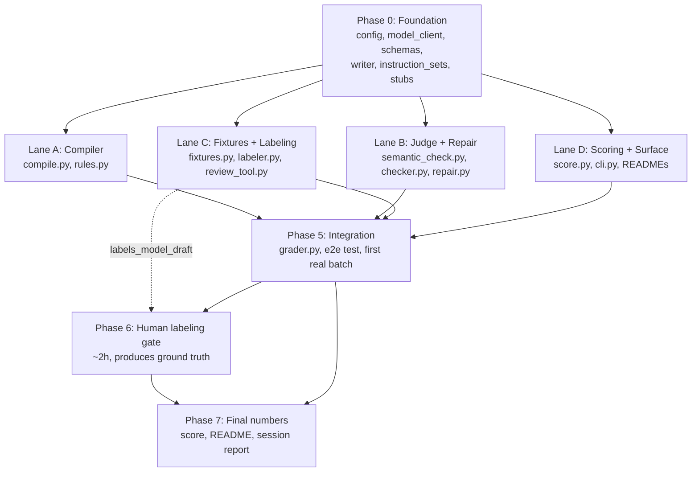

# ROADMAP.md: Instruction Adherence Grader

Six phases, four of them running in parallel Conductor worktrees. Target wall clock: **5–6 hours**,
of which roughly two are a human manually reviewing labels, which is the point rather than an
overhead.

Agents: read your lane in `docs/AGENT_LANES.md` and the interfaces in `docs/CONTRACTS.md`. Do not
work outside your lane's file ownership.

---

## Dependency graph

The four lanes are genuinely independent because Phase 0 ships the three things they would
otherwise fight over: the model client, the schemas, and the instruction sets. Lane C does not wait
for Lane B, because `writer.py` lands in Phase 0. Lane D does not wait for anyone, because it codes
against the frozen JSON schemas and tests on synthetic fixtures it writes itself.

---

## Timeline

| Time | Phase | Sessions | Human involvement |
| --- | --- | --- | --- |
| 0:00–0:45 | Phase 0 foundation | 1 | review the resolved model default, merge |
| 0:45–2:15 | Lanes A / B / C / D | 4 in parallel | spot-check as they land |
| 2:15–2:45 | Phase 5 integration | 1 | resolve any contract-change requests, merge lanes in order |
| 2:45–3:00 | first real batch run + `labels_model_draft.json` | 1 | kick it off |
| 3:00–5:00 | Phase 6 human labeling gate | 0 agents | **you, ~2 hours, in the review sheet** |
| 3:00–5:00 | Lane E polish, running concurrently with the gate | 1 | none |
| 5:00–5:45 | Phase 7 final scoring, README numbers, session report | 1 | read and sanity-check the numbers |
| 5:45–6:00 | definition-of-done audit | 1 audit subagent | accept or fix |

Lane E (polish) exists specifically so an agent is doing useful work during the two-hour human
labeling gate rather than the repo sitting idle. It owns docs, extra tests, CI, and the top-level
README, none of which the labeling gate blocks.

---

## Phases

### Phase 0: Foundation *(single session, on `main`)*
Full brief in `CONDUCTOR_KICKOFF.md`. Ships: scaffold, `config.py`, `model_client.py` (cache,
retry, concurrency cap, fake provider, debug log), `schemas.py`, a real `writer.py`, all 5
instruction sets, stubs for everything else, the `Makefile` with every target pre-declared, and the
docs. Exit criterion: `make test` green with no API key.

### Phase 1, Lane A: rule compiler and deterministic checks
`compile_instructions` turns a plain-English instruction set into `Rule` objects, split into
deterministic and semantic. A small pattern-matching layer over recognized instruction shapes is
fine and expected at this scope; general natural-language-to-code compilation is not the goal.

Deterministic coverage required, at minimum one recognized pattern each:
word/character limit, banned word or phrase, required element (signature block, specific reference),
punctuation constraint (question marks, exclamation marks).

Semantic coverage required, at least two distinct types among: specificity, tone, implied content.
For each, the compiled artifact is a well-specified judge prompt that states what counts as a
violation and what does not, with a `judge_prompt_sha` recorded.

### Phase 2, Lane B: semantic judge, checker, repair
One model call per semantic rule, strict structured output `{"pass": bool, "reason": str}`. Raw
request and response logged for every call so a verdict is auditable rather than a boolean you have
to trust. `check_email` runs deterministic rules inline with no network call and dispatches semantic
rules one at a time.

Repair: exactly one call to the writer model, given the original instructions, the current draft,
and the specific violations (rule id plus reason), asking for a single corrected version that fixes
those without introducing new ones. The caller re-runs the **full** checker on the result, because a
fix for one rule routinely breaks another (shortening to hit a word cap is the standard way to
delete the specific company reference). Still failing means **held**: reported as undeliverable with
the still-failing rules named. No second repair attempt.

### Phase 3, Lane C: adversarial fixtures, blind labeling, review tooling
50 emails across the 5 instruction sets. Per email, decide at generation time which rules if any to
deliberately violate and instruct the writer to violate exactly those; record as
`planted_violations`. Mix: some clean on every rule, some breaking exactly one, some breaking two
or more, and a deliberate share where the violation is borderline enough that reasonable people
could disagree, because that is where the grader's semantic judgment actually gets tested.

Adversarial cases the fixture set must include:
- implied pricing with no banned word ("cost-effective," "pays for itself," "ROI in weeks"),
- a company reference that name-drops the company but is otherwise industry boilerplate, next to one
  that references something specific and checkable,
- rhetorical or indirect questions that avoid a literal "?" but function as questions ("You might be
  wondering how this fits your stack."),
- tone that drifts corporate subtly rather than obviously, against a "casual" instruction,
- near-limit word counts (89 vs 91) to stress both the deterministic boundary and whether repair can
  hit a tight cap without breaking another rule.

Then `labeler.py`: a blind first pass over all 50, receiving only the email and the plain-English
instructions, using a prompt distinct from the checker's and never importing `semantic_check.py`.
Output to `labels_model_draft.json`.

Then `review_tool.py`, which is what makes the two-hour gate survivable: a single self-contained
HTML review sheet, one row per (email, rule), showing the email body, the instruction, the draft
verdict and its reason, with keyboard-driven confirm/overturn and a reason field, that exports
corrected JSON. A CSV fallback is acceptable if HTML runs long. Roughly 300 judgment calls at ~20
seconds each is the budget; anything that adds five seconds per row costs 25 minutes.

### Phase 4, Lane D: scoring and surface
Two separate computations that are never conflated:

- **Adherence rate**: over the batch, the percentage of emails passing every rule, counting a
  successful single repair as a pass. Headline operational number. Comes from the real pipeline run.
- **Grader precision / recall / F1**: the checker's **pre-repair**, per-rule verdicts against
  `labels_ground_truth.json`. Positive class is "violation present." Reported per rule, in
  aggregate, and split deterministic vs semantic. Deterministic should be at or near perfect;
  semantic is where the real signal is. Burying one inside an aggregate F1 hides which failure mode
  dominates.

Also the CLI: one entrypoint with `fixtures`, `label`, `review`, `grade`, `score`, `report`
subcommands, a `--limit N` for cheap iteration, and a `--no-cache` escape hatch.

### Phase 5: Integration *(single session)*
Merge lanes in order A, B, C, D, each rebased on `main`. Ownership is disjoint, so the only expected
conflicts are in files Phase 0 already froze; if you hit one, Phase 0 under-specified something and
the fix goes in the shared file, not in a lane. Reconcile `docs/contract-changes/*.md`. Write
`grader.py`, wire the CLI end to end, add `test_grader_end_to_end.py` and the held-email test, then
run the real batch and the labeler.

### Phase 6: Human labeling gate *(you, ~2 hours)*
Work through the review sheet. Confirm or overturn every draft verdict. Review every semantic
judgment carefully; deterministic rows are mechanically verifiable and can go fast, but still go
through them, and say in the README that you did it that way. Save `labels_ground_truth.json`.
This step is manual by design and cannot be delegated back to a model without making the whole
exercise circular.

### Phase 7: Final numbers and the record
Run `make score`. Fill the README's leading numbers. Write the holds section: not "3 held" but which
three and why, in one line each. Run `scripts/session_report.py` to generate the parallel-build
table in `docs/CONDUCTOR_LOG.md`. Then the audit pass below.

---

## Definition of done

Every item is a checkbox in the audit pass. Anything unchecked goes in the README limitations
section, explicitly, rather than being quietly omitted.

- [ ] `compile.py` produces a mix of deterministic and semantic `Rule` objects with at least one
      recognized pattern for each of: word/character limit, banned word or phrase, required element,
      punctuation constraint; and at least two distinct semantic rule types.
- [ ] `grader.py` runs compile -> check -> repair -> score end to end on a batch, producing both a
      per-email result and a batch summary.
- [ ] One-repair-then-hold is implemented and covered by a test: an email still failing after repair
      is reported as held with reasons, neither silently dropped nor silently sent.
- [ ] 50 fixture emails across 5 instruction sets exist, with planted violations and the adversarial
      semantic cases listed in Phase 3.
- [ ] `labels_model_draft.json` exists from a blind run with a prompt separate from the checker's;
      a human-reviewable correction format exists; `labels_ground_truth.json` reflects actual manual
      review.
- [ ] `score.py` reports adherence rate and grader precision/recall/F1 (aggregate, plus the
      deterministic/semantic split) as separate, clearly labeled numbers.
- [ ] The example README leads with those numbers, then method, then limitations, and carries the
      synthetic-data and no-real-product-touched disclosures near the top.
- [ ] Unit tests exist for the deterministic checks; at least one end-to-end smoke test exists; the
      whole suite passes with no API key under `MODEL_PROVIDER=fake`.
- [ ] No individual is named anywhere in the repo; no real company, customer, or email address
      appears in any fixture.
- [ ] `docs/CONDUCTOR_LOG.md` reflects the real session/branch/commit record, generated rather than
      hand-written.

---

## Risk register

| Risk | Why it bites | Mitigation, already in the plan |
| --- | --- | --- |
| Circular evaluation | The grader grading itself reads as 100% accurate and means nothing | three-file separation; labeler prompt distinct from checker; human review is the only ground truth |
| Sign-flip between `passed` and `violated` | Silently inverts precision and recall; the numbers still look plausible | one conversion point in `score.py`, named, unit-tested |
| Scoring post-repair emails against pre-repair labels | Inflates apparent grader accuracy | contract says `initial_results` is the compared field; assert it in a test |
| Incomplete ground truth scored silently | 100% recall on the rules that happened to be covered | `score.py` raises on a missing (email, rule) pair |
| Four agents, one API key | Rate limits, flaky lanes, wasted hours | concurrency cap, backoff, disk cache, fake provider for all tests |
| Merge conflicts eating the parallel gain | The whole showcase premise collapses | disjoint file ownership; `pyproject.toml` and `Makefile` frozen in Phase 0; contract changes go to per-lane files |
| Labeling gate overruns | The second number never gets produced | review tool built in Lane C, not improvised at hour four; shrink the fixture set before skipping the labeling |
| Model ID drift | Hardcoded IDs break the repo weeks later | env-configurable, verified at build time, documented in `.env.example` |
